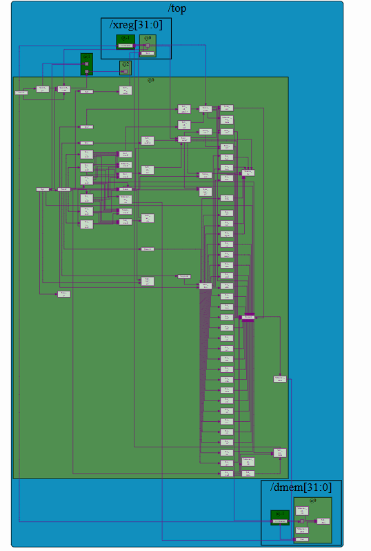

# Building-a-RISC-V-CPU-Core

This project implements a simple **RISC-V RV32I CPU core** in **TL-Verilog**, created while following the *Building a RISC-V CPU Core* course on [Makerchip](https://makerchip.com/).




---

##  What is RV32I?
- **RV** → RISC-V (open Instruction Set Architecture)  
- **32** → 32-bit registers and 32-bit program counter  
- **I** → Integer base instruction set (arithmetic, logic, load/store, and control flow)  

RV32I is the foundation of the RISC-V ISA, providing about 40–50 essential instructions without extensions like multiplication (M), floating point (F/D), or compressed instructions (C).

---

##  Features Implemented
- **Instruction Fetch & Decode**
  - Instruction memory (IMem)
  - Opcode, funct3/funct7, rd, rs1, rs2, imm decode
- **ALU Operations**
  - Arithmetic: `ADD`, `SUB`, `ADDI`
  - Logical: `AND`, `OR`, `XOR`, `ANDI`, `ORI`, `XORI`
  - Shifts: `SLL`, `SRL`, `SRA`, `SLLI`, `SRLI`, `SRAI`
  - Set-on-compare: `SLT`, `SLTU`, `SLTI`, `SLTIU`
- **Branching & Jumping**
  - Conditional branches: `BEQ`, `BNE`, `BLT`, `BGE`, `BLTU`, `BGEU`
  - Unconditional jumps: `JAL`, `JALR`
- **Upper Immediate**
  - `LUI`, `AUIPC`
- **Memory Access**
  - Load word: `LW`
  - Store word: `SW`
- **Register File**
  - 32 registers (x0–x31), with x0 hard-wired to 0
- **Program Counter**
  - Sequential execution (`PC+4`)
  - Branch/jump targets
  - JAL/JALR return address (link register)

---

##  Tools & Environment
- **Language:** TL-Verilog  
- **Simulator:** Makerchip (SandPiper toolchain)  
- **Visualization:** Makerchip’s VIZ  
- **HDL Output:** SystemVerilog generated from TL-Verilog  

---

##  Running the CPU
1. Clone this repository:
   ```bash
   git clone https://github.com/<your-username>/Building-a-RISC-V-CPU-Core.git

##  Project Layout

```

top.tlv                  # TL-Verilog source
riscv\_shell\_lib.tlv      # Imported library (via m4\_include\_lib)
top.sv                   # Generated SystemVerilog
top\_gen.sv               # Additional generated HDL
top.html                 # HTML TLX (visualization)
top\_viz.json             # Simulation visualization data
top\_stats/               # Compiler statistics

````

---

##  Running in Makerchip

1. Open [Makerchip](https://makerchip.com).
2. Paste `top.tlv` into the editor.
3. Ensure this include is present:
   ```tlv
   m4_include_lib(['https://raw.githubusercontent.com/stevehoover/LF-Building-a-RISC-V-CPU-Core/main/lib/risc-v_shell_lib.tlv'])


4. Compile & Simulate.
5. In VIZ:

   * PC increments normally, branches/jumps redirect as expected.
   * Stores/loads show activity in DMem.
   * At the end, registers **x5–x30 = 1**.
6. The LOG should print:

   ```
   Simulation PASSED!!!
   ```


---

##  Design Notes

* **PC Update**

  ```tlv
  $next_pc = $reset ? 32'b0 :
              $is_jalr   ? $jalr_tgt_pc :
              $is_j_instr? $br_tgt_pc :
              $taken_br  ? $br_tgt_pc : $inc_pc;
  ```

* **Write-back Multiplexer**

  ```tlv
  $wb_data = $is_load ? $ld_data : $result;
  ```

* **Data Memory**

  ```tlv
  m4+dmem(32, 32, $reset,
          $result[6:2],   // word index
          $is_s_instr,    // write enable
          $src2_value,    // store data
          $is_load,       // read enable
          $ld_data)       // load result
  ```

---

## ⚠️ Simplifications

* Only **word-aligned, 32-bit loads/stores** (no byte/halfword/LBU/LHU).
* Single-cycle, no pipeline hazards.
* No exceptions/CSRs or privileged mode.

---

##  Credits

* Based on the [*Building a RISC-V CPU Core*](https://github.com/stevehoover/LF-Building-a-RISC-V-CPU-Core) course by **Redwood EDA**.
* Developed and tested in **Makerchip** using **SandPiper TL-Verilog**.

---

##  Next Steps

* Add byte/halfword load/store support.
* Introduce pipelining (3–5 stages).
* Add exception handling and CSRs.
* Expand memory and externalize IMem/DMem.

---

```
